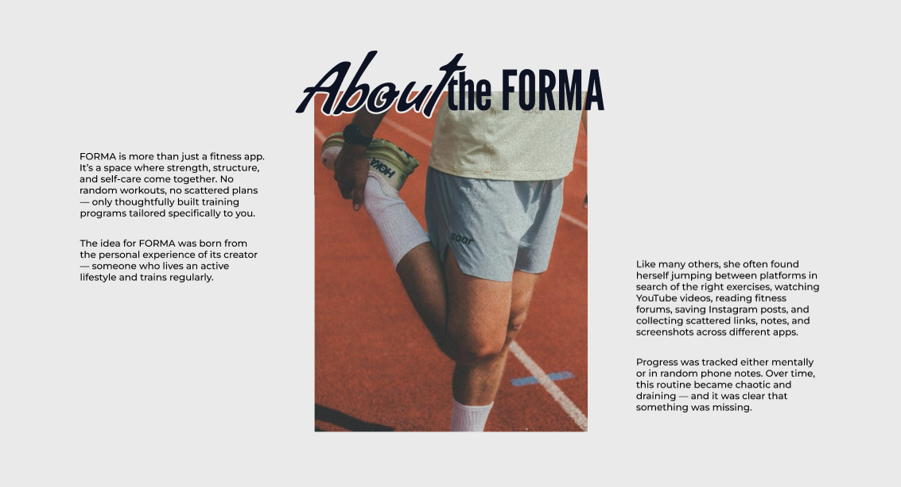
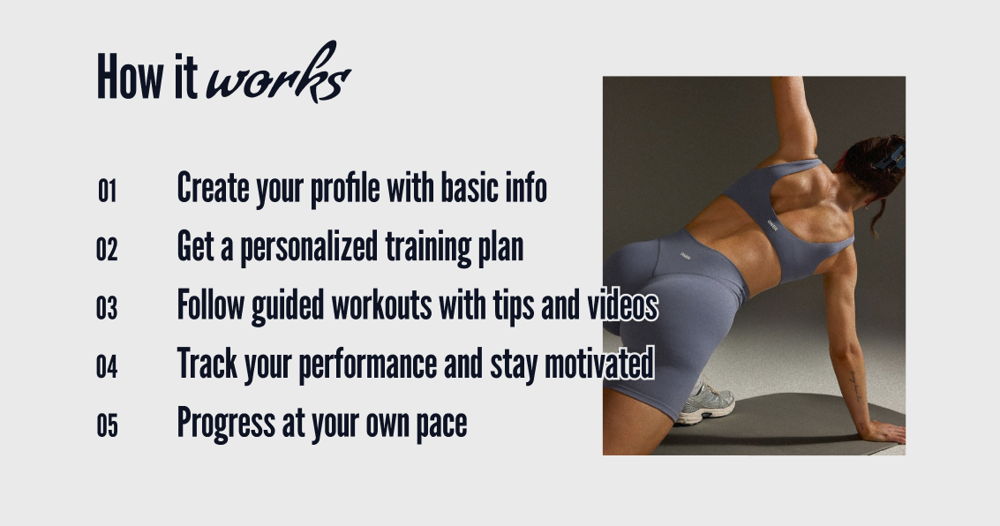
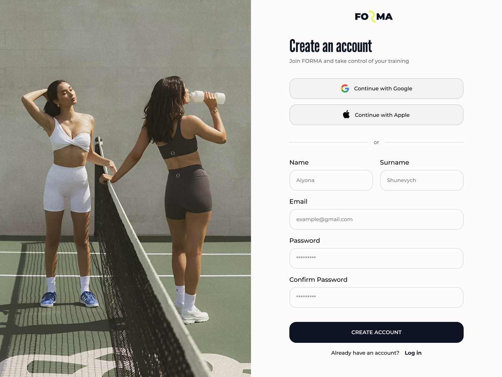
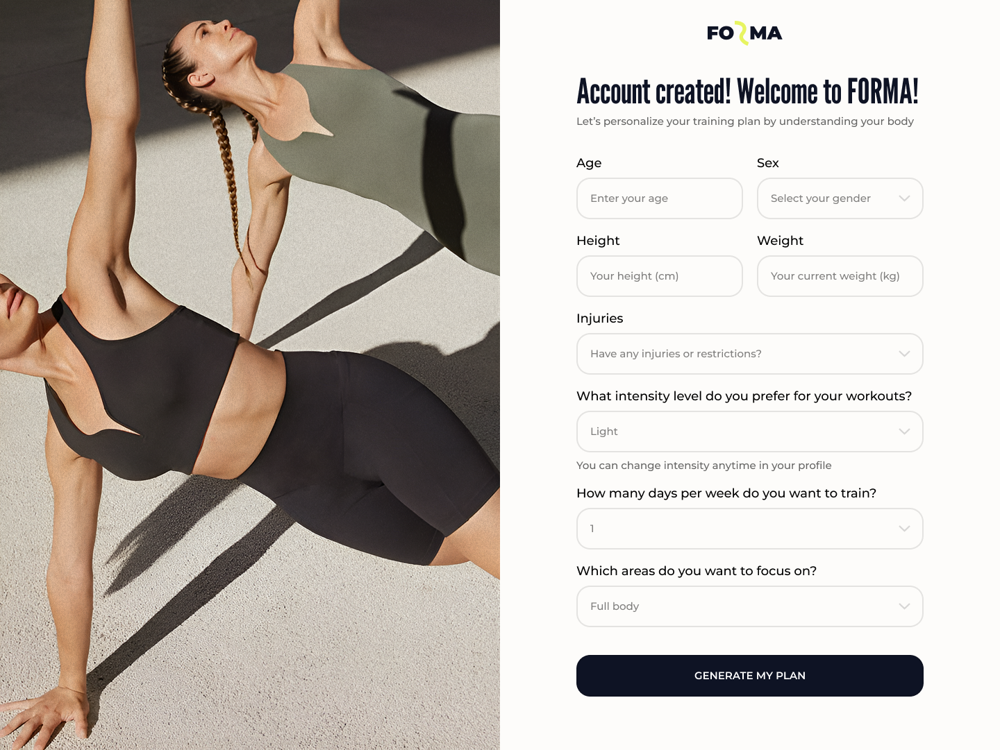
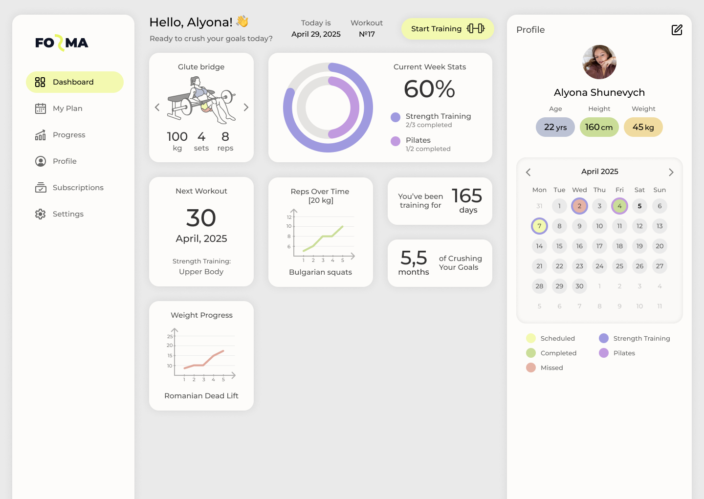
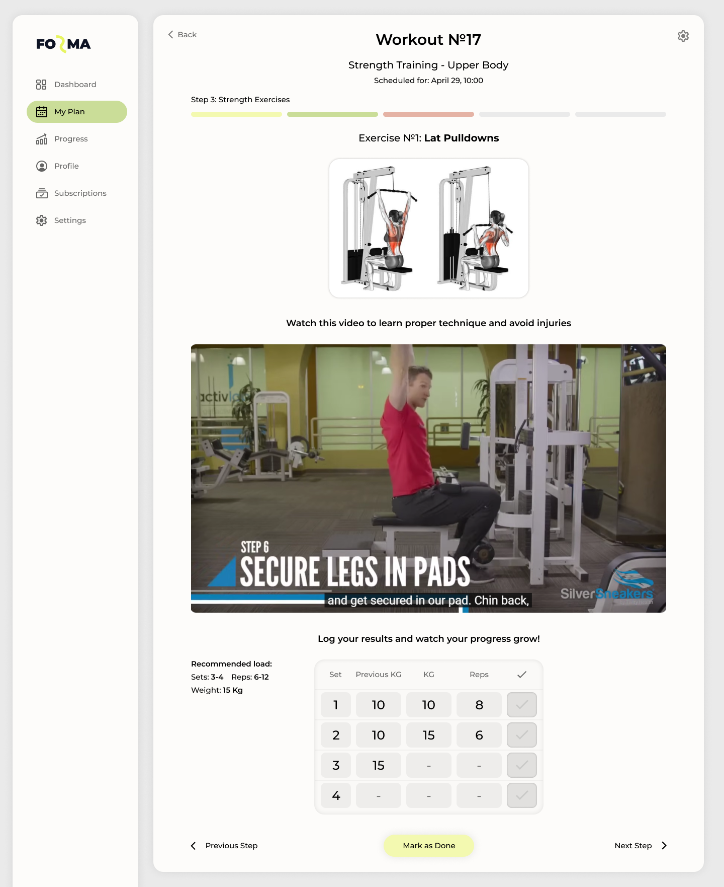
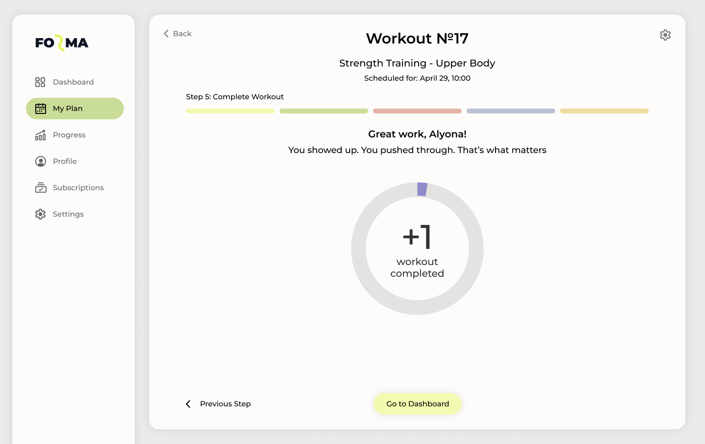

# FORMA — Personalized Fitness Web App

**FORMA** is a web application designed to help users achieve their fitness goals through customized workout plans, progress tracking, and smart recommendations based on personal data.

## 🔗 Demo  
👉 Try it here: [Forma Fitness App Demo](https://alyonashunevych.github.io/forma-fitness-app/)

## 📸 Screenshots

### 🟢 Welcome Page
- Landing page before registration 

### 📝 Create Account
- User registration form  

- Input of personal data and fitness parameters  

### 📊 User Dashboard
- Personal statistics, progress charts, workout calendar and user profile information 

### 🏋️ Workout Flow
- Cardio stage  

- Strength training exercises  

- Workout completion summary  

---

## 🎯 Features

- 📋 Sign up and create a personal profile  
- ⚙️ Enter personal parameters: age, weight, height, gender, activity level  
- 🧠 Goal selection and preferred training intensity  
- 📅 Automatic workout scheduling based on selected days per week  
- 🧩 Step-by-step training modules:
  - Cardio
  - Joint warm-up
  - Main exercises with recommendations and result tracking
  - Optional core activation block
- 🟢 Workout statuses: Scheduled / In progress / Completed / Missed  
- 📽️ Embedded YouTube video instructions per exercise  
- 🖼️ Exercise visuals with targeted muscle groups  
- ✍️ Custom result input: sets, reps, weight  
- 🧠 Personalized load recommendations based on user's profile  
- 🔁 Real-time status update and validation of workout steps  
- 📊 Progress analytics: visual charts 

---

## 🛠️ Tech Stack

- **Frontend**:  
  - React (Vite)  
  - React Router  
  - TypeScript  
  - Sass (SCSS modules)  
  - Context API (for global state: user & training)  

- **Backend**:  
  - Kotlin  
  - Spring Boot  
  - Spring Security (JWT-based auth)  
  - PostgreSQL  
  - MapStruct (DTO mapping)  
  - JPA / Hibernate  

  [Backend repository](https://github.com/alyonashunevych/forma-app_backend)

- **Database**:  
  - PostgreSQL (users, exercises, plans, training history, sets history, etc.)

- **Authentication**:  
  - JWT (JSON Web Token)  
  - Custom user roles & authorization filters

- **Integrations**:  
  - YouTube (embedded instructions)  
  - GitHub Pages (deployment of frontend)

- **State Management**:  
  - React Context for user and training data  
  - LocalStorage (for token & session persistence)

- **Design / Prototyping**:  
  - Figma (UI/UX wireframes and mockups)

---

## 👩‍🎓 Project Details

This project is developed as part of a bachelor's degree thesis in the field of software engineering.  
The system is focused on **personalized fitness experience**, smooth UX, and future extensibility.

**Author**: Olena Shunevych  
**GitHub**: [@alyonashunevych](https://github.com/alyonashunevych)